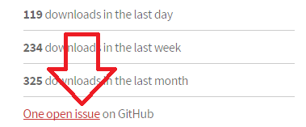

## Create an NPM package

While we host the whole development project on Github the NPM package shall contain just that part a potential user will use.
Hence, we have to create a folder structure that supports this. A good structure would look like this:

    \src  
    \test
    \dist
    \docs
    \guides

    \node_modules\
    \scripts
    \tools

The first block is the working part, here is where you write your project's code. The second block is the supporting infrastructure and
depends on what you really need and want. Usually the code in here is either from an external repository (*node_modules*) or is being
created one time and than just invokes tasks once needed.

The working part consists has two special folders: *\docs* and *\guides*. As you may know is a good documentation the foundation of your
whole project. Without the docs everything has less value. The documentation shall support two parts. Those who want to learn about the 
project before making a decision to give it a try. And those who actively work with the code. In my project I have splittet the two parts
accordingly. The reason is not necessarily the ability to split the documentation. It's because Github has a distinct support for such
texts and I want to make use of it. The first folder we're looking into is *\docs*. This is where this very text resides.

Read about [Github Pages and Markdown](./documentation/documentation) to get a head start.

### Setup the Sources

You probably want to start with a "real" project and take care about the supporting stuff later. That's fine. So let's first setup what we need
at least to get things into NPM. For my project it's sort of a library. So I create a folder *\lib*:

    \src\lib

Because a library needs a lot of testing I am lazy writing plain text a demo app is a good choice. That resides in another folder:

    \src\demo

The pure package is in *\src\lib*. This is what you get when pulling the package from NPM. Everything else is on Github and the user who wants
more must go there. That's why we need the README files. It's all about pointing quickly to the right folders.

#### Initialize the Package

Now once you in the *\lib* folder you can start creating your project. Open a command prompt and enter this:

~~~
npm init
~~~

It's an interactive quest:

There are few things you need to think about before you start:

* Name of the project (in lower case only -- NPM does not allow upper case characters)
* License (such as ISC, MIT, or Apache)
* Description (this will appear very prominently on NPM)
* Keywords (in case you care about new users)

This will create a new file *package.json*. It's more or less the center of your app. It's where all commands you can start come from. 

The final file in my project looks like this:

~~~
{
  "name": "svogv",
  "version": "0.0.14",
  "description": "An advanced set of Angular 4 (Angular2) widgets and model driven forms support.",
  "main": "./bundles/svogv.umd.js",
  "module": "./index.js",
  "typings": "./index.d.ts",
  "repository": {
    "type": "git",
    "url": "https://github.com/joergkrause/svogv.git"
  },
  "keywords": [
    "angular",
    "angular2",
    "angular4",
    "Reactive",
    "Forms",
    "Validation",
    "Viewmodel",
    "decorators",
    "components"
  ],
  "license": "ICS",
  "bugs": {
    "url": "https://github.com/joergkrause/svogv/issues"
  },
  "homepage": "https://github.com/joergkrause/svogv#readme",
  "peerDependencies": {
    "@angular/common": "^2.2.0",
    "@angular/compiler": "^2.2.0",
    "@angular/core": "^2.2.0",
    "@angular/forms": "^2.2.0",
    "@angular/http": "^2.2.0",
    "@angular/platform-browser": "^2.2.0",
    "@angular/platform-browser-dynamic": "^2.2.0",
    "@angular/router": "^3.1.0",
    "core-js": "^2.4.1",
    "rxjs": "^5.0.1",
    "systemjs": "^0.19.38",
    "zone.js": "^0.7.2"
  }
}
~~~

If you now compare this with yours you find that some parts are missing. Let's dive into *package.json* first to get what's important. There are few 
options that simply help others to navigate in your project. These parts are:

  "bugs": {
    "url": "https://github.com/joergkrause/svogv/issues"
  },
  "homepage": "https://github.com/joergkrause/svogv#readme",

They are just pointers to the repository. NPM will extract the values and use this to create links:

Fortunatly, if your repository already exists, the paths are right where they shall be. 

Another part is not yet missing: the dependencies. This part we develop while creating the project. So leave it empty right now. 

#### The Project's Core files

The project we create is an Angular 2 library, created with TypeScript. So we need to setup this properly. The files we need are:

* README.md: 
    
    The documentation's entry point. This file is shown on NPM (not on GitHub). It's sort of your homepage. Remember that we're currently in the *\src\lib\* folder and create just the library. The Github's readme will come later.  

* tsconfig.json:

    The configuration for the TypeScript transpiler. 

* typedoc.json:

    The configuration for the API documentation generator. That's covered in the chapter about [API Documentation](./documentation/api-doc).

* Two files are just for testing. That's covered in the chapter about unit testing:
    * system-config-spec.ts
    * tsconfig-srcs.json

