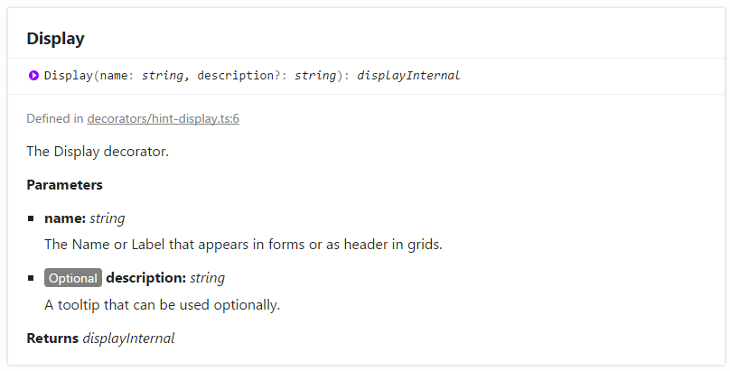

# API Documentation

The API documentation is being compiled from code comments. Code comments follow the JavaDoc rules.

## Tools

We need two tools here:

* TypeDoc

    This is the generator that extracts the comments from files and creates nicely formatted HTML for your users.

* gulp-typedoc 

    This is the integration in the build environment.

## TypeDoc

Let's focus on TypeDoc first. Before you start writing code you should consider a distinct way of adding comments. Regular comments
will simply not make it. So you go with JavaDoc. A headstart for Typescript can be found [here](http://typedoc.org/). Before you get lost in
the Web I'll give a brief introduction here.

The generator understands these tags:

    @param <param name>
    @return(s)

All other tags will be rendered as definition lists, so they are not lost.

### Function Signatures

When writing documentation for function signatures, you don’t have to repeat yourself. TypeDoc automatically copies comments and tags of the 
function implementation to its signatures for you. Of course you can still overwrite them if you wish to.

    /**
    * @param text  Comment for parameter ´text´.
    */
    function doSomething(target:any, text:string):number;

If there is a return value you should describe this as well:

    /**
    * @param value  Comment for parameter ´value´.
    * @returns      Comment for special return value.
    */
    function doSomething(target:any, value:number):number;

Some additional comment is quite helpful:

    /**
    * Comment for method ´doSomething´.
    * @param target  Comment for parameter ´target´.
    * @returns       Comment for return value.
    */
    function doSomething(target:any, arg:any):number {
        return 0;
    }

### Modules

Modules can be commented like any other elements in TypeScript. As modules can be defined in multiple files, TypeDoc selects the 
longest comment by default. One may override this behaviour with the special @preferred comment tag.

    /**
    * Actual module comment.
    * @preferred
    */
    module MyModule { }

Only the longest line is being used, so in this example the first part is skipped:

    /**
    * Dismissed module comment.
    * This is the longer comment but will be dismissed in favor of the preferred comment.
    */
    module MyModule { }

### Dynamic Modules

The first doc comment within a file is used as the doc comment of a dynamic module. However, you must ensure that the first declaration also has as doc comment.

    /**
    * This is a doc comment for a dynamic module.
    */

    /**
    * This is a doc comment for "someVar".
    */
    var someVar:string = "value";

Watch here for the empty line between the comment blocks. An excerpt from the generated documentation could look like this:

The command is part of the build tool chain. Creating the documentation will, eventually, an automated task on every build. If you need to get it done
separately, invoke this command in the project's root:

~~~
gulp api
~~~

However, if you follow the steps as shown in the book the root may be still empty and hence nothing happens (despite weird error messages).

  
